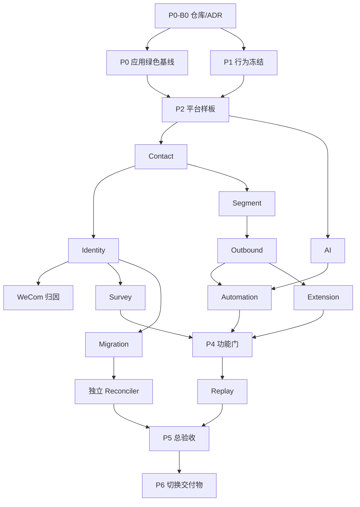

# AI-CRM-v2 implementation plan

状态：`EXECUTING`

负责人：Codex root

内部实现：最多 3 个 `gpt-5.6-terra`（`reasoning_effort=ultra`）任务

## 1. 执行模型

Codex root 独占架构裁决、中央契约冻结/批准、拆片、验收/测试、Git/GitHub、PR、merge
和 main CI。Terra 只在独立 worktree 的白名单内实现/测试；中央合同任务只能机械实现
root 冻结的合同，业务 Slice 不得改中央契约。

最多 3 个固定 `gpt-5.6-terra` / `reasoning_effort=ultra` 任务在依赖已满足且路径不重叠时
按 DAG 并行；root 的验收和 Git/GitHub 流程串行。Terra 不得 stage、commit、push、PR、
rebase、merge、部署或真实外部调用。交回 base、task id、worktree、payload manifest、
测试和 correction；root stage 后计算 canonical diff SHA-256。

每片硬上限为一个模块/API operation/UI flow、8 个手写文件、400 行手写 diff；失败先用
同一 task follow-up，连续两次同根因失败或越界即拒收重拆。不得新建、上传或续接网页
ChatGPT Pro 对话；P0-S01 既有链接仅为历史证据。完整规则见
[`agent-orchestration.md`](../governance/agent-orchestration.md)。

## 2. 阶段依赖

## 3. Slice catalog

### P0

- S01 Go role 启动骨架；S02 `/healthz` strict handler；S03 sqlc 最小查询；
  S04 River 官方 migration/runtime adapter。
- S05 React/Vite 壳；S06 Orval health client。
- S07 import lint；S08 表和企微写入归属 lint；S09 env/SQL/timer lint。
- S10 空 contract-replay runner。

### P1

- S01 旧路由 exporter；S02–S04 三个域组 API 对照；S05–S07 三个页面组
  功能矩阵；S08 证据 validator；S09 contact/identity 映射；S10 其余迁移
  映射。
- OpenAPI 由 Codex 按核心、运营链、上层域三批串行冻结。

### P2

UoW、强类型 config、settings/secret、River role、scheduler、event append、
dispatcher、请求/错误中间件、并发预算、登录、RBAC、router、Web shell、
stages store/service/handler/page，共 17 片。

### P3

- Contact：列表 store、标签阶段、分区时间线、handler、列表 UI、详情/操作
  UI、20 万数据性能。
- Identity：规范化/upsert、Resolve、Bind、merge、Ingest、pending replay、
  人工待合并 API、页面、并发负例。
- WeCom：验签/AES、回调去重、token/read client、同步、identity/contact 集成。
- Segment：AST、编译器、EXPLAIN、成员刷新、handler、UI。
- Outbound：store、EnqueueOne、EnqueueBatch、sender、状态/事件、重试取消、
  handler、UI。

严格顺序：contact → identity → wecom → segment → outbound。

### P4

- AI：provider/fake、prompt、火山 adapter、API、页面。
- Automation：规则、enrollment、共享 DSL、四种 action、规则页、记录页。
- Survey：CRUD、H5、OAuth、提交 Ingest、后台页。
- Gateway/MCP：旧行为 adapter、兼容 harness。
- Extension：API key、resolve、bind、ingest、customer read、outbound、webhook
  状态、签名投递、支付 mock。
- Stats：聚合、API、看板；Ops：队列、日志、健康、三面板。

执行优先级：AI → Automation → Survey → Gateway → Extension → Stats →
Ops → 剩余功能矩阵。

### P5/P6

- Replay：loader、路由转换、diff、runner、报告。
- Migration：只读 extractor、contact/identity、timeline、outbound、survey/其余、
  checkpoint/incremental。
- Reconciler：使用独立内部 Terra task，且不提供 migration 源码；计数聚合、逐字段
  抽样、故障注入。
- P6 只准备构建/SBOM、迁移脚本、备份恢复、冒烟和观察回滚清单；真实切换
  不在当前授权内。

## 4. 阶段门

- G1：merged/deprecated、核心 API 字段、页面矩阵和迁移映射人工签字。
- G2：staging 登录/stages 浏览器验证。
- G3：测试企微、Audience diff、S 档性能和手机收信。
- G4：真实 automation/问卷/MCP/运维演练。
- G5：两轮 replay、只读副本迁移、独立对账、人工逐页面抽验。
- G6：切换窗口、停写、URL/DNS、回滚和旧机销毁授权。

未授权门统一写 `PENDING_EXTERNAL_GATE`，不得由 local/mock/synthetic 替代。
