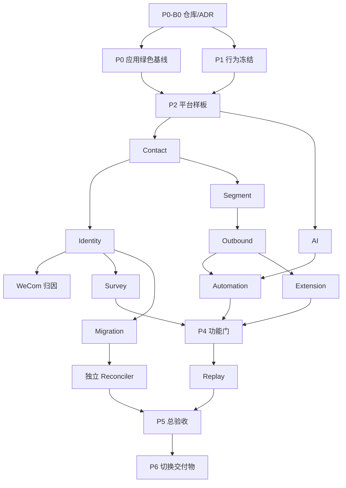

# AI-CRM-v2 implementation plan

状态：`EXECUTING`

负责人：Codex root

当前实现：P0 由单一 Codex Sol 端到端闭环

## 1. 执行模型

P0 由 Sol 直接负责架构裁决、契约、实现、测试、修正、Git/GitHub、PR、merge 和
精确 main SHA CI。每个完整行为尽量一个垂直 PR；超限时按可独立验收的行为拆分，
不再为小实现单独建立 Terra 回执、中间契约 PR 或上传包。

阶段策略固定为：P1 可将互不依赖的事实盘点交 Terra 分组并行，Sol 汇总裁决；P2
共享平台核心由 Sol 主做，孤立组件按需委派；P3/P4 优先用 Go + 新架构恢复旧业务
能力，不新增产品能力。契约冻结后，互不依赖、路径不重叠且不改共享契约的业务路径
允许并行 PR；中央契约裁决、最终 rebase/merge 与精确 main CI 串行。迁移与对账必须
由与实现者独立的 Agent 复核；最多 3 个并行任务。

每片硬上限为一个模块/API operation/UI flow；P2 为 12 个手写文件/800 行，P3 为 12 文件/1000 行，完整行为硬顶 15/1500。Sol 在
同一 PR 内修正；委派失败先用同一 task follow-up，连续两次同根因失败或越界即拒收重拆。
P3/P4 的每个 PR 必须关闭一个官方业务 Slice，或经用户/权威计划批准且可在 feature
matrix 定位的完整业务 flow；禁止 parser/checker/governance-only PR。本次策略迁移
是唯一例外，合并后不再以治理迁移名义扩张。

修正硬停只看 `slice_induced`：达到 2 时冻结范围并降档，当前片可在不扩 scope 下
完成既定闭环；达到 3 时立即停报并重切。`infra_induced` 与
`verification_induced` 精确留痕但不降档、不硬停，机械环境、命令、测试夹具时序在
原任务修复；只有涉及共享基础设施或业务范围才另片。预期生成物与既有
hash/manifest/ledger receipt 的正常同步是 Definition of Done；首次遗漏被门发现才记
一次 `verification_induced`。独立安全片仅限不可逆数据污染、鉴权、迁移或真实外发的
明确风险，其他安全工作优先随业务垂直片完成。
不得新建、上传或续接网页
ChatGPT Pro 对话；P0-S01 既有链接仅为历史证据。完整规则见
[`agent-orchestration.md`](../governance/agent-orchestration.md)。

## 2. 阶段依赖

## 3. Slice catalog

### P0

- S01 Go role 启动骨架；S02 `/healthz` strict handler；S03 sqlc 最小查询；
  S04 River 官方 migration/runtime adapter。
- S05 React/Vite 壳；S06 Orval health client。
- S07 import lint；S08 表和企微写入归属 lint；S09 env/SQL/timer lint。
- S10 空 contract-replay runner。

### P1

- S01 旧路由 exporter；S02–S04 三个域组 API 对照；S05–S07 三个页面组
  功能矩阵；S08 证据 validator；S09 contact/identity 映射；S10 其余迁移
  映射。
- OpenAPI 由 Codex 按核心、运营链、上层域三批串行冻结。

### P2

UoW、强类型 config、settings/secret、River role、scheduler、event append、
dispatcher、请求/错误中间件、并发预算、登录、RBAC、router、Web shell、
stages store/service/handler/page，以及 S/M/L 分档生成与 Compose/staging 脚本，共 18 片。

### P3

- Contact：列表 store、标签阶段、分区时间线、handler、列表 UI、详情/操作
  UI、20 万数据性能。
- Identity：规范化/upsert、Resolve、Bind、merge、Ingest、pending replay、
  人工待合并 API、页面、并发负例。
- WeCom：验签/AES、回调去重、token/read client、同步、identity/contact 集成。
- Segment：AST、编译器、EXPLAIN、成员刷新、handler、UI。
- Outbound：store、EnqueueOne、EnqueueBatch、sender、状态/事件、重试取消、
  handler、UI。

波次顺序以 AGENTS.md §4 为准：`contact → (identity ∥ segment) → (wecom ∥ outbound)`。每波次启动前冻结对应域 OpenAPI 与公共 port。

### P4

- AI：provider/fake、prompt、火山 adapter、API、页面。
- Automation：规则、enrollment、共享 DSL、四种 action、规则页、记录页。
- Survey：CRUD、H5、OAuth、提交 Ingest、后台页。
- Gateway/MCP：旧行为 adapter、兼容 harness。
- Extension：API key、resolve、bind、ingest、customer read、outbound、webhook
  状态、签名投递、支付 mock。
- Stats：聚合、API、看板；Ops：队列、日志、健康、三面板。

执行优先级：AI → Automation → Survey → Gateway → Extension → Stats →
Ops → 剩余功能矩阵。

### P5/P6

- Replay：loader、路由转换、diff、runner、报告。
- Migration：只读 extractor、contact/identity、timeline、outbound、survey/其余、
  checkpoint/incremental。
- Reconciler：使用独立内部 Terra task，且不提供 migration 源码；计数聚合、逐字段
  抽样、故障注入。
- P6 只准备构建/SBOM、迁移脚本、备份恢复、冒烟和观察回滚清单；真实切换
  不在当前授权内。

## 4. 阶段门

- G1：merged/deprecated、核心 API 字段、页面矩阵和迁移映射人工签字。
- G2：staging 登录/stages 浏览器验证。
- G3：测试企微、Audience diff、S 档性能和手机收信。
- G4：真实 automation/问卷/MCP/运维演练。
- G5：两轮 replay、只读副本迁移、独立对账、人工逐页面抽验。
- G6：切换窗口、停写、URL/DNS、回滚和旧机销毁授权。

未授权门统一写 `PENDING_EXTERNAL_GATE`，不得由 local/mock/synthetic 替代。
