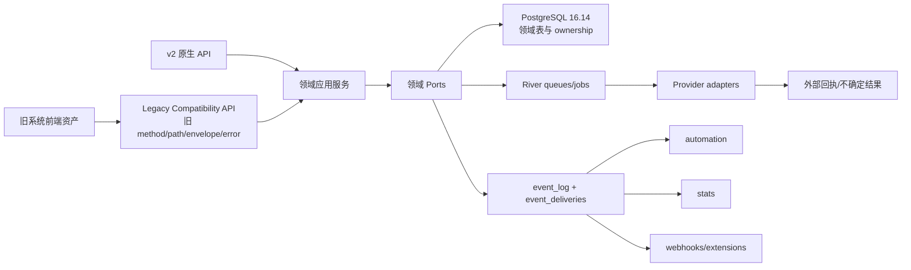
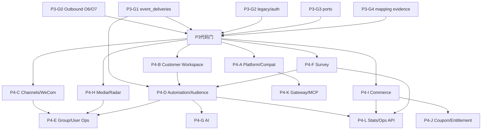

# AI-CRM v2 P4 旧系统后端能力全量对齐实施计划

> **For Claude:** REQUIRED SUB-SKILL: Use superpowers:executing-plans to implement this plan task-by-task.

**Goal:** 在不新做前端 UI 的前提下，用 Go 与 AI-CRM v2 现有架构完整恢复旧 AI-CRM 的标准业务能力、兼容接口与可验证行为；先补齐 P3 对 P4 必需的底层能力，再按本计划进入 P4。

**Architecture:** 旧前端继续使用旧 URL、请求体、响应体和错误语义，通过无业务逻辑的 Legacy Compatibility API 适配层调用 v2 各领域服务。领域之间只通过 port、事件和 River job 协作，禁止跨域直写；不可逆写、鉴权、支付回调和外部副作用保留幂等、审计、回执与人工外部门。

**Tech Stack:** Go 1.26.5、PostgreSQL 16.14、sqlc、River、OpenAPI/Orval、React 仅作为旧 UI 兼容验收资产、GitHub Actions、repo-contract、secret-scan。

---

## 0. 文档地位与强制结论

### 0.1 文档地位

- 本文承接用户在 2026-08-13 的最新决定，是 P4 开发、排期、验收和 P3 入场门的执行依据。
- 用户最新决定优先于旧 P4 章节中“支付、商品属于外部定制组件”“新增 Extension API/运维 UI 优先”等旧结论。
- 旧系统的能力是否进入 P4，以冻结旧仓库和经批准的 `docs/feature-matrix.csv` 中逐项行为为准，不以旧代码所在目录是否名为 `extensions` 判断。
- 每个 PR 必须关闭本文列出的业务片或其经批准的更小重切片；禁止以纯治理、纯 checker、纯 parser、纯文档同步冒充业务进度。

### 0.2 已确认的产品边界

1. **P4 不开发新 UI。** 旧系统前端直接复用；P4 的交付物是后端能力、兼容 API、数据合同、后台任务和外部效果边界。
2. **旧系统已有的标准能力全部属于重构范围。** 包括但不限于问卷、商品、订单、微信支付、支付宝、优惠券、周期权益、群运营、用户运营、素材、雷达、自动化、AI、统计、MCP。
3. **真正的客户定制扩展才走 Extension API。** Extension API 不能成为漏做商品、支付、订单等标准能力的替代品。
4. **以具体操作而不是“大项存在”判断完成。** “有问卷模块”不代表问卷 CRUD、题型、评分、H5、OAuth、提交、归因、外推、数据导出都已完成。
5. **只计可运行闭环。** 本地候选、开放 PR、文档、接口骨架、HTTP 200、排队成功均不能单独计为业务完成；代码完成至少要求 merge、exact-main CI 全绿和黑盒行为证据。

## 1. 对齐基线与事实盘点

### 1.1 权威代码基线

| 对象 | 基线 |
| --- | --- |
| 旧系统冻结证据 | `6cb989c071255437d75953dabb943318a74eb8f4` |
| 旧系统审计时最新 main | `4d309c0e3fa2c5981a542f9f83d9bb93b746be89` |
| 本计划起草时 v2 exact-green main | `2cb7ce47b5a0c08939a8a8ab30e6229495b6b810` |
| 旧系统当前相对冻结版 | 没有新增路由；主要是问卷后台交互和即时群发素材/media 解析的语义修正 |

旧系统最新 main 与冻结证据没有出现新的大能力域，因此冻结路由、功能矩阵和迁移映射仍可作为 P4 完整性基线；最新语义差异必须在问卷和素材发送相关业务片中额外吸收。

### 1.2 全量盘点数字

| 清单 | 数量 | P4 使用方式 |
| --- | ---: | --- |
| 旧路由记录 | 781 | 逐路由分类为兼容、内部替代、明确退休或外部门 |
| A 级路由 | 501 | 必须具备完整兼容行为 |
| B 级路由 | 268 | 必须有明确替代路径和兼容响应，不能静默遗漏 |
| C 级路由 | 12 | 仅在证据证明退休/外部门后保留稳定退役语义 |
| 冻结功能矩阵行 | 293 | 逐行绑定 P4 slice、测试和 merge SHA |
| 含服务端/API 的功能矩阵行 | 287 | P4 后端/API 的直接范围 |
| 纯前端本地动作 | 6 | 复用旧 UI，不新做 UI；只验证后端不破坏其依赖 |
| 唯一 method/path 参考 | 约 355 | Legacy Compatibility API 的初始兼容面 |
| 数据迁移映射 | 316 | 表/字段/语义对账与 P5 数据迁移前置 |

> 注意：当前 `docs/feature-matrix.csv` 的 `implementation_status`/`verification_status` 仍不能直接代表 v2 已合入的 P3 事实。进入 P4 前必须重建“旧能力行 → v2 业务片 → PR/SHA → 黑盒证据”的映射，但不得把更新矩阵拆成纯治理 PR。

### 1.3 旧能力域总量

| 能力域 | 旧路由 | 矩阵业务行 | 本计划项目 |
| --- | ---: | ---: | --- |
| 平台、后台配置、作业与兼容入口 | 149 | 32 | P4-A |
| 客户工作台、侧边栏、标签、负责人、归档 | 84 | 42 | P4-B |
| 渠道、企微入口与回调归因 | 13 | 14 | P4-C |
| 自动化、AI Audience、群运营、用户运营、Agent、Cloud、HXC、运营周期 | 255 | 82 | P4-D/P4-E |
| 问卷 | 42 | 17 | P4-F |
| 商品、订单、支付、优惠券、周期权益 | 159 | 70 | P4-I/P4-J |
| 素材与雷达 | 77 | 36 | P4-H |
| MCP | 2 | 0 | P4-K |
| **合计** | **781** | **293** | P4-A～P4-L |

## 2. 目标架构与旧 UI 套用方案

### 2.1 Legacy Compatibility API 的职责

兼容层只能做以下工作：

- 复现旧 method/path、参数名、分页/游标、响应 envelope、状态码和稳定错误码；
- 把旧 session/CSRF/API key 解析成 v2 `Principal`；
- 把旧请求 DTO 映射为领域 command/query，把领域结果映射回旧响应；
- 保留旧系统已冻结的 302、404、409、410、422、503 等可观察语义；
- 在旧 UI 需要聚合多个领域读取时调用只读 ports，不直接查询别的领域表；
- 对已经正式退休的端点返回稳定的 retirement 响应和 replacement 信息。

兼容层禁止：

- 写业务规则、复制状态机、跨域 SQL 或直接调用 provider；
- 为了兼容旧 UI 改写 v2 领域真相；
- 用万能 JSON、动态 SQL 或“暂时返回空数组”掩盖未实现能力；
- 把 A/B 级旧能力降为 410，除非有逐项用户批准。

### 2.2 双合同策略

- **外部兼容合同：** 旧 URL、请求、响应、错误和鉴权语义，供旧 UI 与旧集成直接使用。
- **内部领域合同：** v2 typed service/port/event；保持领域边界与新架构演进能力。
- 两者通过显式 DTO mapper 连接。兼容测试固定旧合同，领域测试固定业务语义，避免兼容细节污染核心。

### 2.3 数据所有权

- 每张新表只允许一个领域 owner；跨域读取走 port/projection，跨域写走 command/event。
- 金融、身份、外发、问卷提交、优惠券核销均使用 append-only 审计事实与幂等收据。
- 旧系统表名可以作为迁移 source，但不作为新系统跨域共享数据库接口。
- migrations 必须连续编号、可 up/down/up，并通过独立迁移复核；降级策略必须在真实新数据存在时可执行。

### 2.4 外部效果与真实性分层

| 状态 | 含义 |
| --- | --- |
| accepted | 本地命令和幂等收据已持久化 |
| queued | River job 已与业务事实原子提交 |
| attempted | provider adapter 已被调用 |
| executed | provider 明确接受或完成 |
| outcome_unknown | 调用可能发生但结果不可确定，禁止盲目自动重试 |
| reconciled | 后续查询/回调已把不确定结果收敛为终态 |

真实企微、真实支付、真实退款和真实发送不在无人值守 P4 执行范围；代码验收用官方格式 fixture、测试 provider 和 sandbox/staging。外部门单独记录，不混入代码完成度。

## 3. 进入 P4 前必须完成的 P3 底层能力门

P4 不得直接从旧 T4.1～T4.8 开工。以下能力全部达到 CLOSED 后，才允许发布第一个 P4 PR。每项必须以现有 P3 业务能力为可观察出口，禁止纯框架 PR。

### P3-G0：Outbound 可靠外发闭环与后端兼容 API

**现状：** O1～O5 已闭环；原 O6 因真实 retry 后 migration 回滚不成立达到 HARD STOP。必须从最新 exact-green main 全新重切。

**交付：**

- O6-R：River 负责 `retryable_failed` 的重试调度与 attempt 生命周期；同一业务任务重试不重复创建 task/event/provider 调用；`outcome_unknown` 禁止自动重试；取消与 retry 的竞争有稳定结果。
- migration 必须先证明“已经产生 attempt 1+2 后仍能安全降级”，禁止只有空库 down 成功。
- O7：提供旧 UI/旧集成需要的发送任务查询、批量查询、取消、人工重试、attempt/receipt 查询 API；只做后端/API，不做 O8 新 UI。
- 对真实外发保持禁用；使用可注入测试 provider。

**完成门：** O6-R、O7 分别独立 PR、exact-main CI 全绿；migration up/down/up 在含 retry 历史数据时通过；旧接口黑盒合同通过。

### P3-G1：多消费者事件投递

**为什么是 P3 基座：** 现有 `event_log.dispatched` 只能表达单消费者。P4 的 automation、stats、webhook、MCP、外部回推同时消费事件，若继续共用一个布尔位会出现一个消费者抢走其他消费者事件的确定性丢失。

**最小业务出口：** 选择两个已经存在的 P3 消费者作为真实闭环，例如 Identity/Contact 时间线投影与 Outbound 状态投影，证明同一事件可被两个订阅者独立领取、失败、重试和完成。

**数据合同：**

- `event_deliveries(event_id, consumer, status, attempt_count, available_at, locked_at, completed_at, last_error)`；
- `(event_id, consumer)` 唯一；消费者状态独立；
- at-least-once，消费者自身幂等；
- 注册表使用代码冻结的 consumer 名称，禁止任意数据库字符串驱动动态执行；
- `event_log.dispatched` 在安全迁移窗口后只作为兼容投影，不再决定多消费者可见性。

**完成门：** 双消费者黑盒、消费者崩溃恢复、 poison event 隔离、锁超时重领、真实历史数据降级均通过。

### P3-G2：Legacy Compatibility 入口、主体与鉴权基座

**最小业务出口：** 旧前端无需改动即可完成“会话确认 → CSRF 获取 → 当前配置/能力读取 → 一个已合 P3 的客户列表或待合并列表调用”。

**交付：**

- `internal/legacyapi` 仅包含 transport、DTO mapper、error mapper 和 middleware；
- 支持旧 admin/sidebar/H5/external 的路由分组与 principal 类型；
- session、CSRF、RBAC、owner scope 与 API key scope 均 fail-closed；
- 新增 external API client/key 的最小存储、轮换、撤销、scope 与调用审计；密钥只保存不可逆摘要；
- rate limit 与 request id/actor/source 写审计；
- 旧 UI boot 所依赖的兼容接口真实调用 v2 P3 服务，不返回占位数据。

**完成门：** 旧 UI 静态资产不改即可启动并调用至少一个 P3 真实 flow；错误 envelope、过期 session、CSRF、越权、撤销 key、重复 key 黑盒通过。

### P3-G3：跨域业务 Ports 完整性

这不是“先设计一套万能接口”，而是核对 P4 将直接复用的现有业务能力是否已有稳定 port。缺失 port 必须与一个现有 P3 可观察业务操作同片交付。

| Port | P4 消费者 | 必须具备的能力 |
| --- | --- | --- |
| Contact | Automation、Survey、Commerce、WeCom | 客户读取、标签变更、负责人/阶段读取、时间线追加 |
| Identity | Survey、Commerce、WeCom、Gateway | Resolve/Bind/Ingest、pending/replay、合并审阅 |
| Segment | Automation、Outbound | 成员预览、冻结成员集、刷新状态、版本化读取 |
| Outbound | Automation、Group Ops、User Ops | EnqueueOne/Batch、查询、取消、retry、receipt |
| Events | Automation、Stats、Gateway | publish、订阅、delivery checkpoint、replay |
| Media | Outbound、Questionnaire、Group Ops | 稳定 material reference、租约、variant、provider media receipt |

**完成门：** 每个 port 有 ownership、鉴权/tenant 语义、幂等与错误合同；没有跨域 SQL；至少由两个实际领域调用的 port 才可冻结为 public port。

### P3-G4：兼容能力映射与证据基线

此项不得独立提交纯 checker PR。它随 P3-G1～G3 的业务 PR 同步完成。

每个旧功能矩阵行增加或维护以下事实：

- `legacy_route_id` / `feature_id`；
- P4 项目与 slice；
- `compatibility_mode=EXACT|ADAPTED|RETIRED_APPROVED|EXTERNAL_GATE`；
- v2 route/service/port；
- normal/boundary/error acceptance；
- merge SHA、exact-main SHA；
- 外部门状态。

**P3 总门：** G0～G4 全部 CLOSED；P3 代码侧最终报告明确哪些是代码完成、哪些仍是外部门；未完成项为 0 才进入 P4。

## 4. P4 项目与具体能力明细

### P4-A：平台、后台管理与兼容入口

**旧范围：** 平台/后台/config/jobs 149 条路由中的平台部分，约 32 条矩阵业务行。

**具体能力：**

- 登录、登出、session 查询、账号、角色、RBAC、CSRF；
- 系统设置分类读取/写入、敏感字段脱敏、预检；
- API client/key 创建、轮换、撤销、scope、审计；
- runtime config、版本信息、依赖/回调/OAuth/支付预检；
- release validate/publish/rollback 状态 API；
- setup/checklist、API docs 索引和能力清单；
- 管理作业触发、状态、失败原因、重跑与取消；
- push center、internal event、webhook inbox、external-effect receipt 查询；
- data health、delivery lineage、任务/队列健康读取；
- common operation members 查询及 scope 过滤；
- 已退休作业返回稳定 410 和 replacement。

**架构接入：** `legacyapi` → `auth/config/adminops` services；作业统一进入 River；敏感配置通过 typed settings；平台只读投影不得直写业务域。

**初始业务片：**

- A01 旧 session/CSRF/RBAC 兼容闭环；
- A02 系统设置与敏感字段脱敏；
- A03 API client/key 生命周期与审计；
- A04 runtime/preflight/setup 能力；
- A05 release 与配置发布/回滚；
- A06 admin jobs 生命周期；
- A07 push/internal/webhook/external-effect 查询；
- A08 data health/lineage/common members/退休端点。

### P4-B：客户工作台、侧边栏、标签、负责人和归档

**旧范围：** 84 条路由、42 条矩阵业务行；复用 P3 Contact/Identity 已完成能力。

**具体能力：**

- 客户列表、游标分页、筛选、详情、时间线；
- 标签目录 CRUD、标签同步、客户打标/移除、批量标签；
- 阶段、负责人、owner scope、客户转交与归档；
- sidebar bind-mobile、context token、workbench bootstrap；
- 企业微信 JSSDK config 与当前外部联系人上下文；
- sidebar profile、时间线、问卷、商品、订单、周期订单、素材、其他员工消息聚合读取；
- 周期订单备注写入；
- timeline source 跳转和稳定 detail URL；
- lead pool、signup tags、marketing status；
- 归档客户搜索、同步状态和只读历史；
- owner migration 的提交、冲突、回滚、审计。

**架构接入：** 兼容层调用 Contact/Identity/Survey/Commerce/Media 只读 ports 聚合；写操作仍交给各 owner domain。侧边栏不成为共享数据库后门。

**初始业务片：** B01 客户读模型兼容；B02 标签目录与客户标签；B03 sidebar 鉴权/bootstrap；B04 profile/timeline；B05 问卷/商品/订单/素材聚合；B06 lead/marketing/archive；B07 owner transfer/migration。

### P4-C：渠道、企微获客与回调归因

**旧范围：** 13 条路由、14 条矩阵业务行；复用 P3 WeCom W1～W5 与 Identity。

**具体能力：**

- 渠道列表、新建、编辑、启停、删除；
- 渠道码/二维码生成、下载、刷新和失效；
- 获客链接创建、状态与归因；
- 员工分配、比例、24 小时上限与冲突校验；
- 欢迎语、欢迎素材、入群引导、标签配置；
- URL 验证、消息验签/AES/CorpID、事件去重与分发；
- 通讯录/外部联系人分页同步、游标续跑；
- 新增联系人建档、unionid/phone 归因、时间线、标签与来源；
- 回调失败可重试，未知事件 fail-closed 并可审计。

**架构接入：** WeCom adapter 只负责 provider 协议；建档和归因调用 Identity/Contact ports；素材用 Media reference；回调事实进入 inbox + event deliveries。

**初始业务片：** C01 渠道存储/CRUD；C02 员工分配与配额；C03 QR/获客链接；C04 欢迎内容/标签；C05 callback→identity/contact 归因全链。

### P4-D：自动化与 AI Audience

**旧范围：** 自动化与 audience 是 255 条运营域路由的核心部分。

**具体能力：**

- 规则 CRUD、版本、启停、复制；
- 事件触发、时间触发、条件树与动作序列；
- enrollment 幂等、状态、步骤、重试、取消、失败原因；
- 标签、阶段、来源、问卷、订单、支付、优惠券、群事件等触发条件；
- 打标签、改阶段、加入/移出人群、创建待办、发送消息等动作；
- AI Audience group/package/definition/template CRUD；
- binding、成员计算、刷新、预览、版本和快照；
- send record、webhook、失败重放；
- 0 成员、paused、review/approve、幂等 key 等旧语义；
- 规则执行记录和事件到动作的 lineage。

**架构接入：** event deliveries 为唯一触发入口；规则解释器只输出 typed commands；Outbound/Contact/Segment ports 执行动作；大计算走 River heavy；任何发送仍遵守 Outbound receipt。

**初始业务片：** D01 事件订阅/触发；D02 规则存储与版本；D03 条件求值；D04 enrollment；D05 typed actions；D06 audience group/package；D07 成员刷新/版本；D08 template/binding/webhook；D09 send records/lineage。

### P4-E：群运营、用户运营、Agent、Cloud、HXC 与运营周期

**具体能力：**

- Group Ops 计划、节点、目标群、群素材、负责人、队列计数；
- run-due、节点推进、暂停/恢复/终止、webhook、broadcast；
- 群成员/群聊上下文读取与操作成员选择；
- User Ops 人群池、规则、DND、预览、复核、发送记录、失败重试；
- Automation Agent 配置、执行、review/approve；
- Cloud campaign、plan、状态、观测、结果与重放；
- HXC dashboard、send config、执行记录；
- operation cycle、action claim、report、heartbeat、完成/失败事实。

**架构接入：** 计划状态由各 owner domain 持久化；调度走 River；实际消息统一调用 Outbound；客户/群/素材通过 ports；Agent/AI 只生成候选，外部效果仍走审核和 receipt。

**初始业务片：** E01 group plan；E02 nodes/state machine；E03 group assets/targets；E04 scheduling/webhook/broadcast；E05 user pools/DND；E06 preview/review/records；E07 agent；E08 cloud campaign；E09 cloud plan/observability；E10 HXC/cycles/actions/reports。

### P4-F：问卷、评测、H5 与 OAuth

**旧范围：** 42 条路由、17 条矩阵业务行；吸收旧系统最新 main 的问卷管理交互修正。

**具体能力：**

- 问卷列表、新建、读取、编辑、复制、删除、启停；
- definition、题目顺序、题型、必填、选项、校验；
- 评测模板、维度、计分、结果规则、结果文案；
- H5 bootstrap、渲染数据、发布版本和提交；
- 公众号 OAuth start/callback/state 校验；
- 手机号/openid/unionid 归因到 Identity；
- 成功提交同 UoW 写 submission、identity/contact timeline、tags/event；
- 无法归因写 durable pending，后续 replay；
- 完成目标：H5、mini-program、URL/redirect；
- 提交后运营配置、外部 push 配置、push logs 与失败重放；
- 提交列表、详情、答案、评测结果和导出；
- 同 key 幂等、异 payload 冲突、重复 OAuth callback 与回滚。

**架构接入：** Survey owns definition/submission；OAuth adapter 产出 verified identity evidence；归因走 Identity；时间线走 Contact；外推走 Outbound/Gateway。

**初始业务片：** F01 questionnaire CRUD/schema；F02 assessment/scoring；F03 H5 publish/bootstrap/submit；F04 OAuth；F05 submission→identity/timeline；F06 completion targets/external push；F07 query/detail/export。

### P4-G：AI 生成与辅助能力

**具体能力：**

- AI provider 抽象和旧 provider 行为兼容；
- Volcengine/现有 provider adapter、超时、限流、错误分类；
- prompt template/version、变量校验、启停；
- generation request/result/audit、token/成本元数据；
- AI assist、campaign preparation、话术/素材候选生成；
- automation agent 生成、review、approve、执行前冻结；
- 失败重试、幂等、敏感信息边界；
- AI 输出永远不能绕过外发审核和 Outbound。

**架构接入：** `ai` River queue；provider adapter 与领域解耦；生成结果是候选事实，业务域决定是否采用。

**初始业务片：** G01 prompt/version；G02 provider adapter；G03 generation/audit；G04 AI assist/campaign prep；G05 agent review/execution handoff。

### P4-H：素材、媒体与雷达

**旧范围：** 77 条路由、36 条矩阵业务行；吸收旧系统最新 main 的即时发送 material/media 解析修正。

**具体能力：**

- 图片、附件、小程序卡片、群邀请素材 CRUD；
- 上传、元数据、校验、下载/预览；
- thumbnail、variant、media lease、provider media_id 生命周期；
- material picker 查询与稳定引用；
- message content preview/validate/plan；
- 即时/批量发送前素材解析，禁止把本地 URL 当 provider receipt；
- radar CRUD、短链/H5 redirect、view/click 记录；
- 外部 radar API、统计与 customer timeline 归因；
- 过期 media 刷新、并发租约与失败回退。

**架构接入：** Media owns metadata/reference；provider 上传走 adapter 并保存 receipt；Outbound 只消费稳定 material plan；Radar event 进入 Identity/Contact/Event。

**初始业务片：** H01 images；H02 attachments/miniprograms；H03 group invites；H04 thumbnail/variant/lease；H05 picker/preview/validate/plan；H06 radar CRUD/redirect；H07 tracking/attribution/stats。

### P4-I：商品、订单与支付核心

**旧范围：** Commerce 路由主体，和 P4-J 合计 159 条路由、70 条矩阵行。该项目是标准核心能力，不再排除为定制组件。

**具体能力：**

- 商品目录 CRUD、上下架、价格、图片、描述、库存/可售状态；
- 公共商品详情和支付落地页所需数据；
- 统一订单创建、列表、详情、状态、客户身份投影；
- 微信支付下单、签名、回调验签、状态查询、关闭、退款；
- 支付宝下单、回调验签、状态查询、关闭、退款；
- callback inbox、业务幂等、金额/币种/商户校验；
- payment attempt、provider transaction、refund、reconciliation；
- 微信小商店商品/订单同步、游标续跑、重复事件去重；
- 外部订单导入/查询、订单身份修复的替代投影；
- 交易列表、筛选、导出、异常状态；
- 支付成功/退款事件进入 Identity/Contact/Automation；
- `outcome_unknown` 不盲目重试，靠 provider query/reconcile 收敛。

**架构接入：** Product/Order/Payment 分别 ownership；payment adapter 不直接写 Contact；支付事件经 Identity Ingest 和 event deliveries；金融写必须保存原始 provider receipt 摘要与审计。

**初始业务片：** I01 product store/API；I02 public product/landing data；I03 unified order；I04 WeChat pay create/callback；I05 WeChat query/refund；I06 reconciliation；I07 Alipay；I08 WeChat shop sync；I09 external orders/identity；I10 transactions/export；I11 sidebar commerce projections。

### P4-J：优惠券、权益与周期商品

**具体能力：**

- 优惠券模板 CRUD、规则、有效期、库存、启停；
- code 生成/导入、claim、预占、释放、过期；
- redeem/核销、幂等、订单绑定、退款回补规则；
- 领取/使用数据、统计和导出；
- 周期商品 CRUD、定价、可售状态；
- public grid、share link、支付入口；
- entitlement 创建、激活、周期、到期、暂停/恢复；
- member grid、客户关联、周期订单；
- 周期订单备注、服务期数据、导出；
- 支付/退款与权益状态的一致性和补偿。

**架构接入：** Coupon 和 Entitlement 各自 ownership；Order/Payment 通过 typed commands/events 联动；核销和权益变更保存 append-only ledger。

**初始业务片：** J01 coupon store/rules；J02 codes/claims；J03 redeem/refund compensation；J04 service products；J05 public grid/share；J06 service order/payment；J07 entitlement lifecycle/member grid；J08 remarks/data/export。

### P4-K：Gateway、MCP 与外部兼容 API

**具体能力：**

- 旧 MCP read/execute 行为与稳定错误；
- external API clients、keys、scopes、rate limit、audit；
- 外部事件、订单、雷达、聊天记录等冻结接口；
- webhook subscription、签名、delivery、retry、disable；
- Extension API 只保留真实外部定制需要的最小入口；
- external payload 不得自报 verified/confidence/source；
- 组件上报事件走 Identity Ingest 和 event deliveries；
- 不实现新的 mock 扩展产品能力作为 P4 完成条件。

**架构接入：** Gateway 是鉴权/DTO/审计边界，不拥有业务事实；command/query 经 public ports；webhook 走 Outbound/Event deliveries。

**初始业务片：** K01 MCP compatibility；K02 external auth/scopes/audit；K03 external read/commands；K04 webhooks/extension ingress。

### P4-L：统计与运维 API

**具体能力：**

- `stats_daily` 及域指标投影；
- daily refresh、增量更新、backfill、重算；
- 客户、渠道、自动化、群发、问卷、订单、支付、优惠券指标；
- 旧 dashboard 所需读取 API；
- queue/job/event-delivery/external-effect 健康 API；
- 数据延迟、失败、lineage 与重放状态；
- 不开发新的运维页面，旧 UI/现有监控消费 API。

**架构接入：** Stats 只消费事件和只读 projection，不反向写业务域；重算走 River heavy；指标带 waterline 和 freshness。

**初始业务片：** L01 stats store/projections；L02 refresh/backfill；L03 dashboard compatibility APIs；L04 operations/health/lineage APIs。

## 5. 初步并行开发方案

### 5.1 总依赖图

### 5.2 P3 补基座并行方案

| 流 | 工作 | 并行条件 | 中央契约 |
| --- | --- | --- | --- |
| P3-0 | O6-R → O7 后端 API | 当前主线连续执行 | migration、Outbound API |
| P3-1 | event deliveries + 两个真实 P3 消费者 | 不与 O6 使用同一 migration 窗口时可 local 开发；发布串行 | migration、events public port |
| P3-2 | legacy/auth + 旧 UI boot 一个真实 flow | 可与 P3-0/1 并行开发 | auth/public routes/OpenAPI |
| P3-3 | ports gap audit 与真实调用补齐 | 按领域并行；只实现确认缺失项 | public ports/shared generated |
| P3-4 | feature mapping/证据同步 | 随以上 PR 完成，不单独占 PR | matrix/hash/ledger DoD |

P3 中央队列按 latest exact-green main 严格串行：migration → OpenAPI/public ports → shared generated。业务代码可并行；后合并者重放并重跑 required CI。

### 5.3 P4 Wave 1：接口兼容和高复用业务底座

P3 门全绿后并行启动：

- P4-A 平台/兼容入口；
- P4-B 客户工作台/侧边栏；
- P4-C 渠道/企微；
- P4-F 问卷；
- P4-H 素材/雷达；
- P4-I 商品/订单/支付。

这六条线代码 ownership 基本分离，可并行开发。Legacy API route registry、OpenAPI、public ports、根依赖和 migration 仍进入中央队列。

### 5.4 P4 Wave 2：依赖事件和领域能力的运营链

- P4-D 自动化/Audience：依赖 event deliveries、Contact/Segment/Outbound 和问卷/支付事件；
- P4-E Group Ops/User Ops：依赖 WeCom、Media、Outbound、Automation；
- P4-J 优惠券/周期权益：依赖 Product/Order/Payment；
- P4-K Gateway/MCP：依赖 external auth/public ports；
- P4-L Stats：依赖稳定事件 schema；
- P4-G AI：prompt/provider 可先行，业务动作接线等待 D/E。

### 5.5 动态并发原则

- 不设固定活跃任务数上限；有清晰业务出口、独立 worktree、独立 owner 路径即可并行。
- 不为凑并发拆纯 DDL、纯 checker、纯 port 或纯文档任务。
- 同一 worktree 只能一个 writer；同一 PG slot 的破坏性测试串行。
- 新 P4 域需要独立 PG16.14 slot 时，先一次性扩展统一 `activate.sh`/`aicrm-v2-pgctl`/doctor 的命名 slot；禁止临时 Docker/容器和未登记端口。
- 建议稳定期同时保持 4～6 条业务线开发、1 条中央契约发布队列；具体数量由冲突率和 CI 吞吐动态调整。
- 同时开放多个非共享 PR 允许提前跑 CI；任何后合并 PR 必须重放 latest exact-green main 并重新跑 required CI。

## 6. 初始 Slice 规模与排期口径

本文列出 85 个初始 P4 业务片：A8、B7、C5、D9、E10、F7、G5、H7、I11、J8、K4、L4。它们是排程上限目录，不是必须按编号机械创建 85 个 PR。

- 若同一用户/API flow 在 12 个手写文件、1000 行和修正阈值内，可合并为一个 slice。
- 若一个条目触及多个不可逆状态机、多个 owner 或超过阈值，必须进一步拆小。
- 预计最终 **70～90 个独立业务 PR** 才能诚实覆盖 293 条行为和约 355 个 method/path，而不是旧方案的 8 个大卡。
- 数量只用于容量规划；完成度按覆盖的能力矩阵行及 exact-main 证据计算，不按 PR 数量计算。

## 7. 每个业务片的标准执行模板

1. 从 latest exact-green main 建全新独立 worktree；激活统一环境并运行 doctor。
2. 冻结本 slice 对应的旧 route/feature/migration 行，写 slice card；禁止实现时回看旧 Python，只使用冻结 rules/evidence/spec。
3. 先写 normal/boundary/error 黑盒 RED；金融、鉴权、迁移、外部效果增加永久负例。
4. 实现最小领域行为、compatibility mapper 和必要数据变更；不扩相邻业务片。
5. 运行 focused tests、PG16.14 up/down/up、ownership/catalog、race、repo-contract、secret-scan。
6. 清空实现思路做第二阶段自审：diff、migration、ownership、auth、idempotency、rollback、外部效果。
7. 同步 feature matrix、mapping、generated/hash/manifest/ledger 等 DoD；这些同步不单独计修正。
8. 中文 PR；required CI 全绿后 match-head squash；证明唯一父、tree 等价；等待 exact-main CI 全绿后 CLOSED。
9. 记录代码完成与外部门分界；真实企微、真实支付、真实退款、真实发送、staging 人工抽验必须标为外部门，未执行不得写成功。

## 8. 完整性验收与退出标准

### 8.1 单能力验收

每个矩阵行至少有：

- 旧页面/操作；
- 旧 method/path/request/response/error；
- v2 compatibility route；
- v2 domain service/port；
- normal/boundary/error 测试；
- 权限、owner、幂等、rollback 证据；
- merge SHA 和 exact-main SHA；
- 外部门状态。

### 8.2 板块退出标准

- 该板块所有 A 级路由 exact-compatible；
- B 级路由有逐项替代映射且旧 UI 不需改；
- C 级路由有批准的 retired/external-gate 证据；
- 所有对应矩阵行不再是 `NOT_STARTED/NOT_RUN`；
- 领域表 ownership、migration、up/down/up、事件和 River job 通过；
- 不存在占位响应、空数组假完成、动态 SQL 或跨域直写；
- merge + exact-main CI 全绿。

### 8.3 P4 代码侧 CLOSED

只有同时满足以下条件，才能宣布 P4 代码侧 CLOSED：

1. 781 条旧路由全部有处置，293 条功能矩阵全部有实现与验证映射；
2. 287 条服务端/API 行全部由 v2 后端真实承接；
3. 旧 UI 不修改即可完成所有标准旧业务 flow；
4. 商品、订单、支付、优惠券、周期权益、问卷、群运营等不存在“大项有名、具体操作缺失”；
5. 每个领域 exact-main CI 全绿且无未收口 HARD STOP 候选；
6. 外部门单独列明，不能用测试 provider 伪装真实发送/支付完成；
7. 输出最终能力对照表、PR/SHA 列表、数据迁移覆盖表和未执行外部门清单。

## 9. 明确不做的内容

- 不开发任何 P4 新 UI、O8 UI、Extension 运维 UI 或新 dashboard 页面；
- 不创造旧系统不存在的新产品能力；
- 不把标准商品/支付/订单/优惠券能力外包给未实现的 Extension API；
- 不读旧 Python 作为开发时实现参考；开发只用冻结证据；
- 不执行生产 DB、live migration/cutover、真实企微写、真实支付、真实退款或真实外发；
- 不以 mock、占位 API、文档或 CI 绿替代真实业务闭环。

## 10. 立即执行顺序

1. 保留原 O6 HARD STOP 证据只读，从 latest exact-green main 完成 O6 重切与 O7 后端 API。
2. 并行启动 P3-G1 event deliveries、P3-G2 legacy/auth、P3-G3 ports gap 的精确审计和业务闭环；中央契约串行。
3. 将 P3 已合能力重新映射到 293 行功能矩阵，随业务 PR 更新证据。
4. G0～G4 全部 exact-main CI 全绿，发布 P3 代码侧最终报告。
5. 进入 P4 Wave 1；优先平台兼容、客户/侧边栏、渠道、问卷、素材、Commerce 六线并行。
6. 依赖解除后自动进入 Wave 2，直到 P4 完整性退出标准满足。
